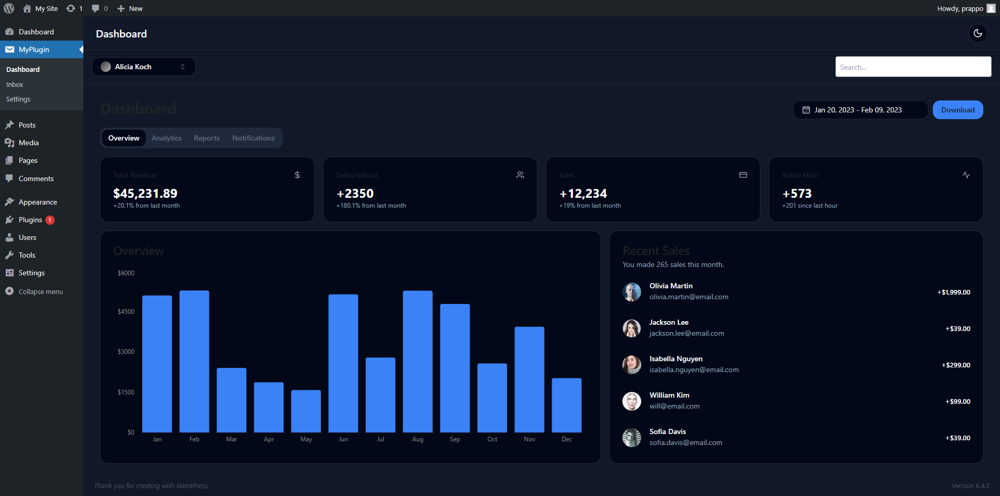
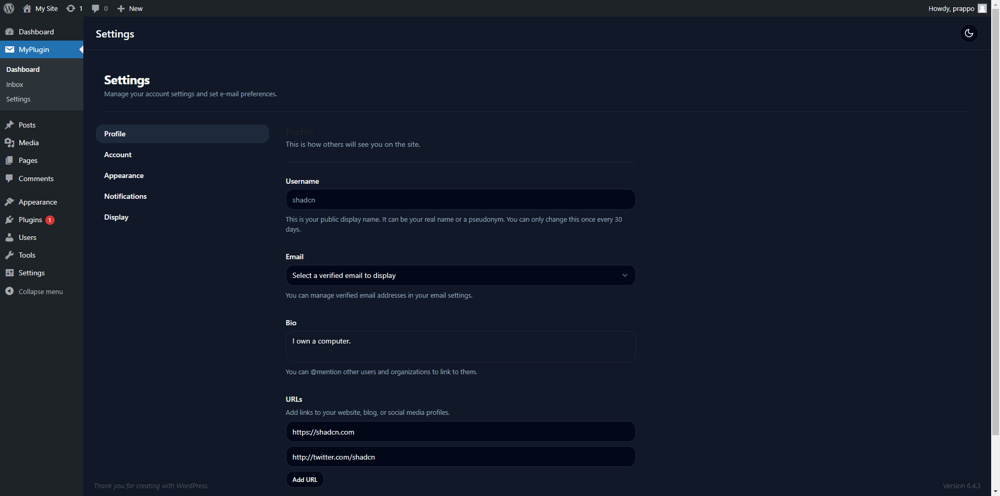

# WordPress Plugin Boilerplate
Create your WordPress plugin in weeks, not months. Rapidly prototype and deliver your plugin with confidence!
## Preview

<a href='https://prappo.github.io/wordpress-plugin-boilerplate/preview' target="_blank"></a>

### Screenshots

<table>
  <tr>
    <th>Light Mode</th>
    <th>Dark Mode</th>
  </tr>
  <tr>
    <td></td>
    <td></td>
    
  </tr>
  <tr>
    <td></td>
    <td></td>
    
  </tr>
    <tr>
    <td></td>
    <td></td>
    
  </tr>
</table>

## Get Started
The plugin consists of two main components: the frontend, built with React, and the backend, which communicates via an API.

To get started, you need to clone the repository and install the dependencies. Then you can rename the plugin and start development. It's that simple!


## Clone the repository
```bash
git clone https://github.com/prappo/wordpress-plugin-boilerplate.git
```

## Install dependencies
```bash
npm install
composer install
```
## Plugin renaming

You can easly rename the plugin by changing data in `plugin-config.json` file.

```json
{
    "plugin_name":"WordPress Plugin Boilerplate",
    "plugin_description":"A boilerplate for WordPress plugins.",
    "plugin_version":"1.0.0",
    "plugin_file_name":"wordpress-plugin-boilerplate.php",
    "author_name":"Prappo",
    "author_uri":"https://prappo.github.io",
    "text_domain":"wordpress-plugin-boilerplate",
    "domain_path":"/languages",
    "main_class_name":"WordPressPluginBoilerplate",
    "main_function_name":"wordpress_plugin_boilerplate_init",
    "namespace":"WordPressPluginBoilerplate",
    "plugin_prefix":"wpb",
    "constant_prefix":"WPB"
}
```

Then run the following command to rename the plugin

```bash
npm run rename
```


## Structure

<details open>
  <summary><strong>📂 wordpress-plugin-boilerplate</strong></summary>
  <ul>
    <li>
    <details>
    <summary><strong>📂 config</strong></summary>
    <summary>
      <ul>
        <li><summary><strong>📄 plugin.php</strong></summary></li>
      </ul>
    </summary>
    </details>
    </li>
    <li>
    <details>
    <summary><strong>📂 database</strong></summary>
    <summary>
      <ul>
        <li>
        <details>
        <summary><strong>📂 Migrations</strong></summary>
        <ul>
          <li><summary><strong>📄 create_posts_table.php</strong></summary></li>
          <li><summary><strong>📄 create_users_table.php</strong></summary></li>
        </ul>
        </details>
        </li>
        <li>
        <details>
        <summary><strong>📂 Seeders</strong></summary>
        <ul>
          <li><summary><strong>📄 PostSeeder.php</strong></summary></li>
          <li><summary><strong>📄 UserSeeder.php</strong></summary></li>
        </ul>
        </details>
        </li>
      </ul>
    </summary>
    </details>
    </li>
    <li><details>
    <summary><strong>📂 includes</strong></summary>
    <ul>
      <li><summary><strong>📂 Admin</strong></summary></li>
      <li><summary><strong>📂 Controllers</strong></summary></li>
      <li><summary><strong>📂 Core</strong></summary></li>
      <li><summary><strong>📂 Frontend</strong></summary></li>
      <li><summary><strong>📂 Interfaces</strong></summary></li>
      <li><summary><strong>📂 Models</strong></summary></li>
      <li><summary><strong>📂 Routes</strong></summary></li>
      <li><summary><strong>📂 Traits</strong></summary></li>
      <li><summary><strong>📄 functions.php</strong></summary></li>
    </ul>
    </details>
    </li>
    <li><details>
    <summary><strong>📂 src</strong></summary>
    <ul>
      <li><summary><strong>📂 admin</strong></summary></li>
      <li><summary><strong>📂 frontend</strong></summary></li>
      <li><summary><strong>📂 blocks</strong></summary></li>
    </ul>
    </details>
    </li>
    <li><summary><strong>📂 libs</strong></summary></li>
    <li><summary><strong>📂 views</strong></summary></li>
    <li><summary><strong>📂 vendor</strong></summary></li>
    <li><summary><strong> 📄 plugin.php</strong></summary></li>
    <li><summary><strong> 📄 uninstall.php</strong></summary></li>
    <li><summary><strong> 📄 wordpress-plugin-boilerplate.php</strong></summary></li>
  </ul>
</details>

### API Route

Add your API route in `includes/Routes/Api.php`

```php
Route::get( $prefix, $endpoint, $callback, $auth = false );
Route::post( $prefix, $endpoint, $callback, $auth = false );

// Route grouping.
Route::prefix( $prefix, function( Route $route ) {
    $route->get( $endpoint, $callback, $auth = false );
    $route->post( $endpoint, $callback, $auth = false );
});
```
#### API Example
```php
// Get All posts
$route->get( '/posts/get', '\WordPressPluginBoilerplate\Controllers\Posts\Actions@get_all_posts' );

// Get Single Posts
$route->get( '/posts/get/{id}', '\WordPressPluginBoilerplate\Controllers\Posts\Actions@get_post' );
```

## ORM ( Object Relational Mapping )

If you are familiar with Laravel, you will find this ORM very familiar. It is a simple and easy-to-use ORM for WordPress.

You can find the ORM documentation [here](https://github.com/prappo/wp-eloquent)

Create your model in `includes/Models` folder.

Example: `includes/Models/Posts.php`

```php
<?php

namespace WordPressPluginBoilerplate\Models;

use Prappo\WpEloquent\Database\Eloquent\Model;

class Posts extends Model {
	/**
	 * The table associated with the model.
	 *
	 * @var string
	 */
	protected $table = 'posts';

	/**
	 * The attributes that are mass assignable.
	 *
	 * @var array
	 */
	protected $fillable = array( 'post_title', 'post_content' );
}

```

You can access all your posts like this:

```php
$posts = Posts::all();
```

You can also create a new post like this:

```php
$post = Posts::create( array( 'post_title' => 'Hello World', 'post_content' => 'This is a test post' ) );
```

You can also update a post like this:

```php
$post = Posts::find( 1 );
$post->post_title = 'Hello World';
$post->save();
```

You can also delete a post like this:

```php
$post = Posts::find( 1 );
$post->delete();
```

You can also use the `where` method to filter your posts.

```php
$posts = Posts::where( 'post_title', 'like', '%hello%' )->get();
```

You can also use the `orderBy` method to sort your posts.

```php
$posts = Posts::orderBy( 'post_title', 'desc' )->get();
```

## Development

```bash
npm run dev
```
## Development with server

```bash
npm run dev:server
```

## Build

```bash
npm run build
```
## Start block

```bash
npm run block:start
```

## Build block

```bash
npm run block:build
```

## Release

```bash
npm run release
```

It will create a relase plugin in `release` folder
