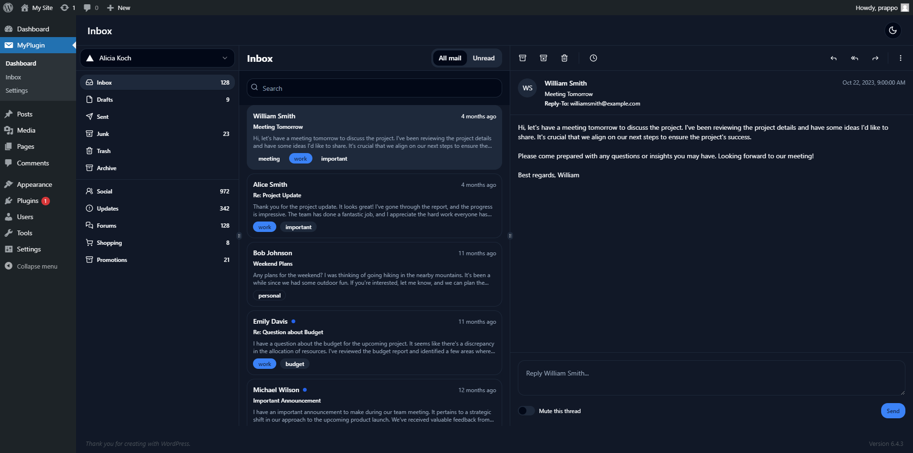

# WordPress Plugin Boilerplate (WIP)
## Preview
<table>
<tr>
<td></td>
<td></td>

</tr>
<tr>
<td></td>
<td></td>

</tr>
<tr>
<td></td>
<td></td>
<td></td>

</tr>
</table>

## Install
```bash
npx wordpress-plugin-boilerplate
```
Or 
```bash
git clone https://github.com/prappo/wordpress-plugin-boilerplate.git
```
```bash
cd wordpress-plugin-boilerplate
```
```bash
composer install
```
```bash
npm install
```

## Development

```bash
npm run dev
```

## Build

```bash
npm run build
```
