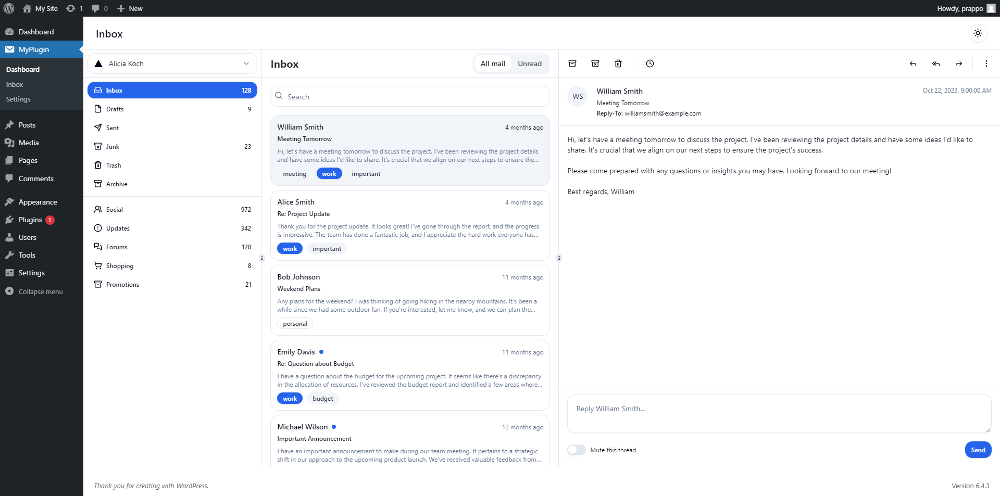
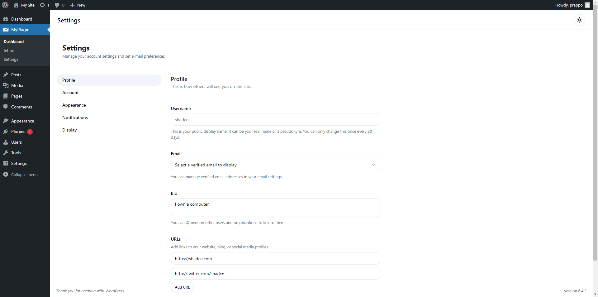

# WordPress Plugin Boilerplate
Create your WordPress plugin in weeks, not months. Rapidly prototype and deliver your plugin with confidence!
## Preview

<a href='https://prappo.github.io/wordpress-plugin-boilerplate/' target="_blank"></a>

### Screenshots

<table>
  <tr>
    <th>Light Mode</th>
    <th>Dark Mode</th>
  </tr>
  <tr>
    <td></td>
    <td></td>
    
  </tr>
  <tr>
    <td></td>
    <td></td>
    
  </tr>
    <tr>
    <td></td>
    <td></td>
    
  </tr>
</table>

## Usages
The plugin consists of two main components: the frontend, built with React, and the backend, which communicates via an API.

### API Route

Add your API route in `includes/Routes/Api.php`

```php
Route::get( $prefix, $endpoint, $callback, $auth = false );
Route::post( $prefix, $endpoint, $callback, $auth = false );

// Route grouping.
Route::prefix( $prefix, function( Route $route ) {
    $route->get( $endpoint, $callback, $auth = false );
    $route->post( $endpoint, $callback, $auth = false );
});
```
#### API Example
```php
// Get All posts
$route->get( '/posts/get', '\WordPressPluginBoilerplate\Controllers\Posts\Actions@get_all_posts' );

// Get Single Posts
$route->get( '/posts/get/{id}', '\WordPressPluginBoilerplate\Controllers\Posts\Actions@get_post' );
```

## Install

```bash
git clone https://github.com/prappo/wordpress-plugin-boilerplate.git
```
```bash
cd wordpress-plugin-boilerplate
```
```bash
composer install
```
```bash
npm install
```

## Development

```bash
npm run dev
```

## Build

```bash
npm run build
```

## Release

```bash
npm run release
```

It will create a relase plugin in `release` folder
